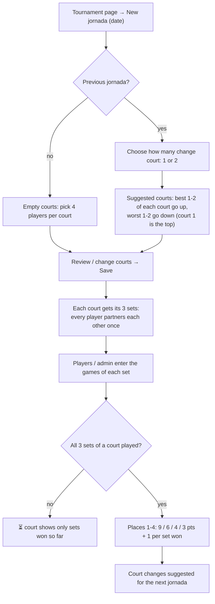
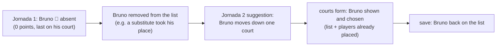
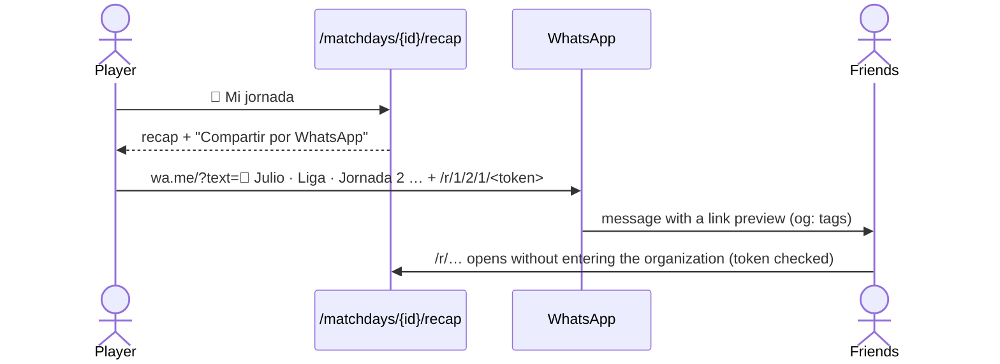
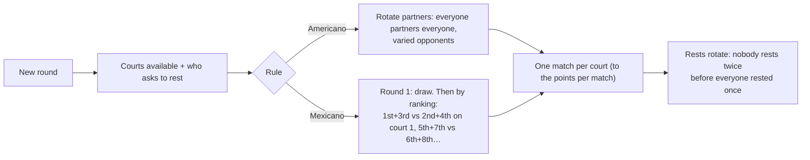

# Jornadas (matchdays and rounds)

A jornada (called "Ronda" in Americano and Mexicano) is one day of a tournament. Its
players are split into courts (canchas) of four. Jornadas are numbered 1, 2, 3… with
no gaps: deleting one renumbers the later ones. Only admins create, change or delete
jornadas.

## Liga de amigos

```mermaid
flowchart TD
    A["Tournament page → New jornada (date)"] --> B{Previous jornada?}
    B -- no --> C[Empty courts: pick 4 players per court]
    B -- yes --> D["Choose how many change court: 1 or 2"]
    D --> E["Suggested courts: best 1-2 of each court go up,<br/>worst 1-2 go down (court 1 is the top)"]
    C --> F[Review / change courts → Save]
    E --> F
    F --> G["Each court gets its 3 sets:<br/>every player partners each other once"]
    G --> H[Players / admin enter the games of each set]
    H --> I{All 3 sets of a court played?}
    I -- no --> J["⏳ court shows only sets won so far"]
    I -- yes --> K["Places 1-4: 9 / 6 / 4 / 3 pts + 1 per set won"]
    K --> L[Court changes suggested for the next jornada]
```

- **Place order:** sets won, then games difference, then league position before the
  jornada. On jornada 1 a draw settles ties.
- **Changing courts** (`/matchdays/{id}/courts`): a court that keeps the same four
  players keeps its sets. A court with new players gets 3 new sets, and its old sets
  are deleted.
- **Absent player** (🚫 next to the name in the court table): a substitute plays in
  their place, but the absent player scores 0 that day and goes last on the court.
  Tap again to mark them present. **They stay in the tournament:** the next jornada's
  suggested courts include them (as last of their court, they move down), even if
  they were removed from the tournament's list in the meantime.
- **Who can be chosen on a court:** the tournament's list plus anyone the suggestion
  already placed. **Saving a jornada puts all its players on the list** (when the
  tournament keeps one), so the list never misses someone who's playing.

```mermaid
flowchart LR
    A["Jornada 1: Bruno 🚫 absent<br/>(0 points, last on his court)"] --> R["Bruno removed from the list<br/>(e.g. a substitute took his place)"]
    R --> S["Jornada 2 suggestion:<br/>Bruno moves down one court"]
    S --> P["courts form: Bruno shown and chosen<br/>(list + players already placed)"]
    P --> L["save: Bruno back on the list"]
```
- **Replace** (next to the name in the court table): opens the replace page. The new
  player takes the place in pending sets and in the tournament list. See
  [Tournaments](TOURNAMENTS.md).

## 🎯 Chances on pending sets

Before its result is entered, each set on the jornada page (and on its result page)
shows each pair's chance of winning, as a bar: for example "58% · 42%". It comes from
the records of the four players ([STATS.md](STATS.md)). Played sets don't show it.

## 📲 Mi jornada (recap and WhatsApp)

`/matchdays/{id}/recap?player={id}`, linked from every jornada page ("📲 Mi jornada") and
from the home page ("Tu última jornada", the account's latest played jornada). It
starts on the logged-in account's player; anyone can pick another player of that
jornada.

- **It shows:** place and points on the court (or 🚫 absent), sets won, the position
  in the standings after that jornada with ▲▼ against the one before, the court of
  the next jornada (if it exists), the medals won that day (`medals.awards` on that
  day's sets and matchday row), and the player's sets.
- **📲 Compartir por WhatsApp** opens `https://wa.me/?text=…` with a ready message and
  the recap's **public link**, `/r/{org}/{jornada}/{player}/{token}`. It opens without
  entering the organization (an open path), and the token (HMAC with the
  organization's secret) means nobody can make up links for other jornadas or players.
  `og:` meta tags give WhatsApp's link preview a title and summary.

```mermaid
sequenceDiagram
    actor P as Player
    participant R as /matchdays/{id}/recap
    participant W as WhatsApp
    actor F as Friends
    P->>R: 📲 Mi jornada
    R-->>P: recap + "Compartir por WhatsApp"
    P->>W: wa.me/?text=🎾 Julio · Liga · Jornada 2 … + /r/1/2/1/<token>
    W->>F: message with a link preview (og: tags)
    F->>R: /r/… opens without entering the organization (token checked)
```

No message is sent by the app: the player chooses the chat. Sending automatically
(email or the WhatsApp Business API) needs a paid or registered service.

## Americano and Mexicano (rounds)

```mermaid
flowchart LR
    A[New round] --> B["Courts available + who asks to rest"]
    B --> C{Rule}
    C -- Americano --> D["Rotate partners: everyone partners everyone,<br/>varied opponents"]
    C -- Mexicano --> E["Round 1: draw. Then by ranking:<br/>1st+3rd vs 2nd+4th on court 1, 5th+7th vs 6th+8th…"]
    D --> F["One match per court (to the points per match)"]
    E --> F
    F --> G["Rests rotate: nobody rests twice<br/>before everyone rested once"]
```

Each player scores the points their pair won in every match.

## Manual individual

A jornada has only a date. There are no courts to assign: the admin, or players logged
in with the tournament's player password, add sets one by one.

## The jornada page

Each court is shown on its own panel, alternating gray and blue so it's easy to tell
the courts apart. A panel holds the court's sets with their games and the court's table
(place, player, games difference, sets won, points). Below the courts are the resting
players (rounds), the court changes (Liga), and the button for the next jornada.

Code: matchday routes are in `app/main.py` (`/matchdays/...`,
`/tournaments/{id}/matchdays/new`). Scoring is in `app/scoring.py`, and round drawing
is in `app/rounds.py`.
